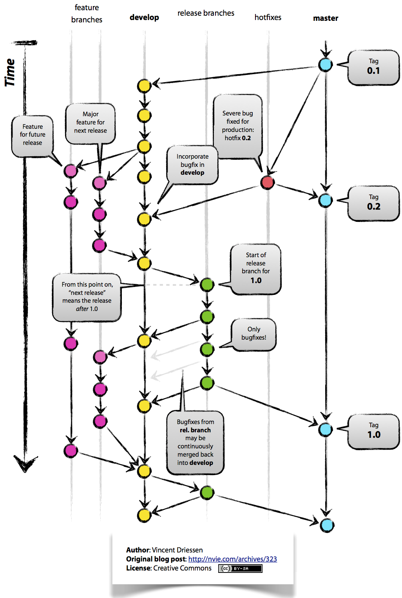
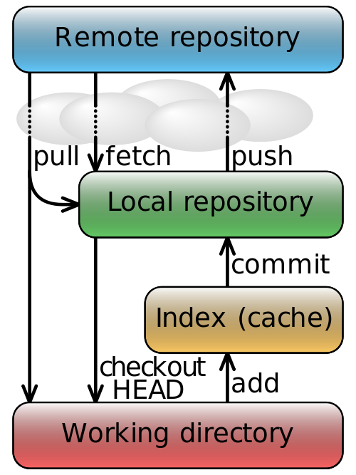

a git workshop
==============

# what is git?

git is

* a version/revision control system
* distributed
* network-independent
* serverless
* fast
* working with a graph of directory tree changes
* using hash values to identify nodes (commits)
* incepted by Linus Torvalds to manage Linux kernel development

# understanding that graph is key to understand git

[A successful Git branching model](http://nvie.com/archives/323 "git-flow"):

# basic workflow

[Simplified git data flow](http://en.wikipedia.org/wiki/File:Git_data_flow_simplified.svg):

# other stuff

* master and origin are just conventions and do not have anything special.
* branches/tags
* remotes
* index/staging area
* stash
* difference of pull vs. fetch/merge
* everything is below a single .git directory
* .gitignore
* bare repository: `git clone --bare <url/path to repo> <bare-repo-name>.git`. Essentially a git repo without a working copy (and the core.bare config option set to true).
* (global) preferences
* (GUI) clients: SourceTree, smartgit, builtin: git-gui & gitk

# documentation

* [git SCM Wiki](https://git.wiki.kernel.org/index.php/Main_Page)
* [http://git-scm.com/doc](http://git-scm.com/doc)
* [interactive online course](http://www.codeschool.com/courses/git-real)

# further topics

* hooks
* submodules
* server installation options (ha!). [gitolite](https://github.com/sitaramc/gitolite)
* adaptors to other systems like SVN
